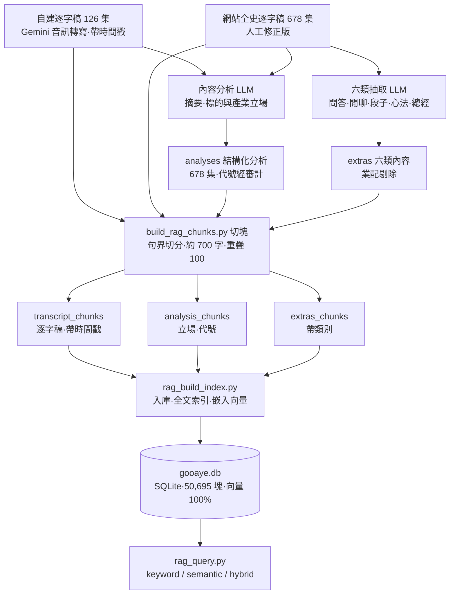
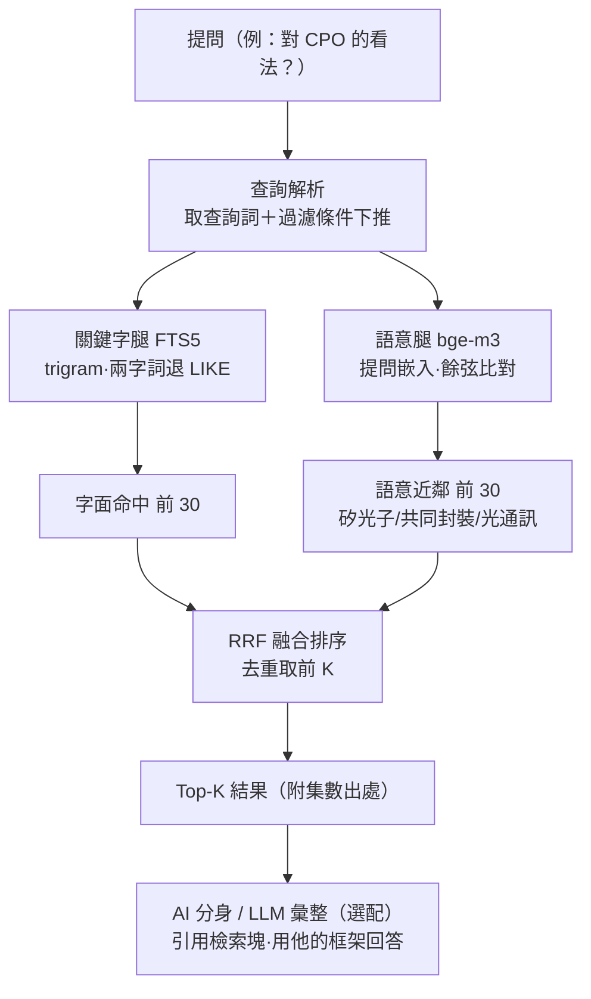

# 股癌 Gooaye Podcast 追蹤器 🎙️

把台灣財經 podcast《股癌》的每一集，從「聽節目」變成「查資料庫」，再進一步變成「跟他對談」。
每集音訊 → AI 分析 → **摘要＋產業觀點＋個股立場時間軸**，累積成可搜尋的儀表板；
全歷史逐字稿另建成本機 RAG 知識庫，驅動一個引用他本人原話的 AI 分身。

> 📊 **線上儀表板**：<https://jiawei0601.github.io/gooaye-tracker/data/dashboard.html>
> 涵蓋 **EP1–EP678（2020-02 開播至今）**、758 檔標的立場演變、751 個產業觀點，
> 每週三/六新集數上架後自動更新。

---

## 一、它提供什麼

| 分頁 | 內容 |
|---|---|
| **每集摘要** | 總經判斷、討論主題、大盤看法、值得記錄的觀點 |
| **標的追蹤** | 每次提到某檔股票的立場（看多/看空/持有中/已出場）與論點，串成時間軸——看得到他對一檔股票數年的完整心路（例如 PLTR：持有→出場→看空→回頭加碼） |
| **產業追蹤** | 同樣的時間軸邏輯套在產業層級 |
| **AI 分身** | 通行碼保護的對談室，問他對任何標的/產業/心態的看法，回答引用節目原話並標集數（後端與資料庫皆私有，見下方） |

新集數處理完另推 Telegram 摘要通知。

---

## 二、資料生產管線（音訊/逐字稿 → 結構化 → 儀表板）

```
SoundOn RSS ─► fetch_feed.py ─► episodes.json（集數註冊表）
                                     │ pending 由新到舊
             ┌───────────────────────┴───────────────────────┐
             ▼                                                ▼
   新集數：下載 mp3                              歷史集數：網站逐字稿
   analyze.py（Gemini 音訊理解）                 analyze_text.py（文字分析）
             └───────────────────────┬───────────────────────┘
                                     ▼
                        analyses/EPxxx.json（摘要/標的/產業立場）
                                     │
                     ┌───────────────┴───────────────┐
                     ▼                                ▼
        aggregate.py                         build_dashboard.py
   tickers.json / industries.json                dashboard.html
                     │                                │
                     ▼                                ▼
              （立場時間軸）                  notify.py（Telegram）
```

- **新集數**走 Gemini 直接聽音檔；**歷史回填**走文字分析（LLM 讀逐字稿），
  可切換 NIM（免費）或 DeepSeek 官方（付費、快 40 倍）——見 `scripts/analyze_text.py --provider`。
- 單集分析為冪等，逐集存檔、中斷不丟進度。
- 生產排程跑在雲端 VM（cron，週三/六），跑完自動 commit＋push，公開資料保持最新。

---

## 三、RAG 知識庫（本機）

全歷史逐字稿與結構化分析被切成可檢索的區塊，建成單檔 SQLite 索引，供語意＋關鍵字混合檢索。

### 3.1 建庫流程（對應第一張流程圖）



**要點**：逐字稿「原文」不經過 LLM、直接進切塊——RAG 裡永遠保有未經轉述的一手內容；
LLM 只負責產出可過濾的結構化衍生層（立場、類別）。同一集若有自建帶時間戳版本就優先用它。

### 3.2 查詢流程（對應第二張流程圖）



**為什麼要雙腿**：關鍵字腿只抓字面講出「CPO」的段落；但他更常用「共同封裝」「矽光子」
「光進銅退」等說法——語意腿靠向量把這些拉到同一空間附近撈回來，**立場演變正是靠語意腿補全**。
過濾條件（`--kind` / `--stance` / `--symbol` / `--industry` / `--category` / `--since` / `--until` / `--ep`）
直接下推進兩腿的 SQL，不是事後篩。

### 3.3 AI 分身

RAG 檢索結果 ＋ 從人物思維框架蒸餾的人格系統提示 ＋ LLM 生成（NIM 主力 → DeepSeek 官方備援），
組成一個會用他語氣、引他原話、標集數的對談分身。網頁「AI 分身」分頁與後端皆以通行碼保護、
加頻率上限，**後端服務與 RAG 資料庫皆私有部署，不在本 repo**。

---

## 四、快速開始（資料管線）

```bash
git clone https://github.com/jiawei0601/gooaye-tracker
cd gooaye-tracker
python -m pip install google-genai

cp .env.example .env        # 填入 AI Studio 的 Gemini API key（免費）
python scripts/daily.py     # 抓 feed → 分析新集數 → 彙整 → 產儀表板 → 推播
```

- 金鑰：<https://aistudio.google.com/apikey>（免費層即可）
- Telegram 推播（選用）：`~/.claude/telegram.env` 填 `TELEGRAM_BOT_TOKEN` / `TELEGRAM_CHAT_ID`
- 排程：cron 或 Windows 工作排程器跑 `scripts/daily.py`

RAG 相關腳本（`build_rag_chunks.py` / `rag_build_index.py` / `rag_query.py`）與分身後端（`server/`）
需額外的逐字稿語料與金鑰，屬本機/私有部署，非公開資料的一部分。

## 五、改追別的 podcast

把 `scripts/common.py` 的 `FEED_URL` 換成目標節目 RSS、調整 `analyze.py` 的 PROMPT 領域詞彙即可，
管線其餘部分通用。

---

## 資料與版權聲明

- 《股癌》節目內容著作權屬於原作者**謝孟恭**。本 repo 公開的 `data/` 僅含 AI 生成的
  **轉化性摘要與立場標註**（含少量短引句）；**節目音訊、逐字稿全文均不在公開 repo**，
  僅存於本機供個人研究。若原作者對資料發佈有異議，將立即移除。
- AI 分析可能出錯（含股票代號辨識，已做全庫審計但不保證完全正確），立場標籤由模型推論、非本人確認。
- **本專案純屬資訊彙整，不構成任何投資建議。**

## License

程式碼採 [MIT](LICENSE)；資料聲明見上節與 LICENSE 附註。
